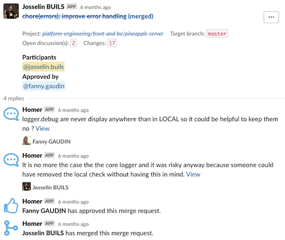
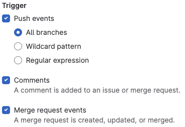

# Homer


Homer is a **Slack** bot intended to help you to easily **share and follow
Gitlab merge requests**.

## Why Homer?

At ManoMano, we were a bit tired of reading Gitlab emails to try keeping up to
date with merge request updates.

Since we use Slack, we decided to create a bot that would help us to share our
merge requests to other developers and to track their progress, so we could
merge them more quickly:



## Usage

### Commands

Here are the available commands:

| Command                                         | Description                                                                                                                                                     |
| ----------------------------------------------- | --------------------------------------------------------------------------------------------------------------------------------------------------------------- |
| `/homer changelog`                              | Generate changelogs for any Gitlab project using release tags.                                                                                                  |
| `/homer project add <project_name\|project_id>` | Add a Gitlab project to a channel.                                                                                                                              |
| `/homer project list`                           | List the Gitlab projects added to a channel.                                                                                                                    |
| `/homer project remove`                         | Remove a Gitlab project from a channel.                                                                                                                         |
| `/homer review <search>`                        | Share a merge request on a channel.<br />Searches in title and description by default.<br />Accepts merge request URLs and merge request IDs prefixed with "!". |
| `/homer review list`                            | List ongoing reviews shared in a channel.                                                                                                                       |

### Share a merge request using Homer

To share a merge request in a Slack channel using Homer, you have to follow the
following steps:

#### 1. Make Homer notified of changes happening in the Gitlab project

To keep up to date the Slack messages it creates, Homer needs to be notified
when something occurs on the related merge requests.

To do so, you need to set up a webhook in the Gitlab project of your merge
request:

- Ask for Homer's `GITLAB_SECRET` to the person that manages Homer in your
  organisation.

- Go to the `Webhooks` setting page of your Gitlab project.

  

- Enter the following URL: `HOMER_BASE_URL/api/v1/homer/gitlab`.

  `HOMER_BASE_URL` should also be provided by the person that manages Homer in
  your organisation.

  

- Enter the value of `GITLAB_SECRET` in `Secret token` field.

  

- Check the following checkboxes: `Push events`, `Comments`,
  `Merge request events`.

  

- Click on the `Add webhook` button on the bottom of the page.

  

- Make sure that the Gitlab user linked to your `GITLAB_TOKEN` has at least the
  `Developer` role in your project:

  - Go to the `Projects members` page:

    

  - Use the search bar to find the information of the user.

  - Check that the role in `Max role` is at least `Developer`.

#### 2. Add the Gitlab project to a Slack channel

If it is the first time that you share a merge request of the Gitlab project in
a Slack channel, you have to link them.

Inside the Slack channel, run one of the following commands:

- `/homer project add PROJECT_ID`
- `/homer project add PROJECT_NAME`

> [!WARNING]
> If you want to use Homer in a private channel, you need to invite it to the
> channel first.

#### 3. Share the merge request

To share a Gitlab merge request to a Slack channel, use the
`/homer review <search>` command.

You can provide a merge request ID prefixed with `!`, e.g.: `/homer review !128`.

If you want to get an overview of merge requests that are still being reviewed
(meaning they are not merged yet), use `/homer review list`.

## Install

### Prerequisites

- [Docker Compose](https://docs.docker.com/compose/install/).
- [Ngrok](https://ngrok.com/download).
- [Node.js@18](https://nodejs.org/en/). You can use a version manager like [nvm](https://github.com/nvm-sh/nvm).
- [Yarn@1](https://classic.yarnpkg.com/lang/en/).

### Install and run

```bash
# Clone the repo
git clone https://github.com/ManoManoTech/homer.git

# Go to directory that was just created
cd homer

# Install yarn dependencies
yarn install

# Start the database Docker container
docker compose up -d

# Build Homer
yarn build

# Start Homer
yarn start

# Open a bridge for external HTTP calls to reach your local Homer instance
ngrok http localhost:3000
```

### Create the Slack app

- Go to https://api.slack.com/apps/.
- Click on `Create New App`.
- Select `From an app manifest`.
- Select the right workspace and click on `Next`.
- In [manifest.json](./manifest.json), replace `HOMER_BASE_URL` with the URL provided by the `ngrok`.
- Copy the content of `manifest.json` file and paste it in the Slack webapp
  modal.
- Create the app and enjoy.

### Add Slack emojis

Homer uses custom emojis when posting messages. To have them properly
displayed, you will need to add all the emojis under [emojis](./emojis) to your
Slack organisation.

## Contributing

See [CONTRIBUTING.md](./CONTRIBUTING.md).
